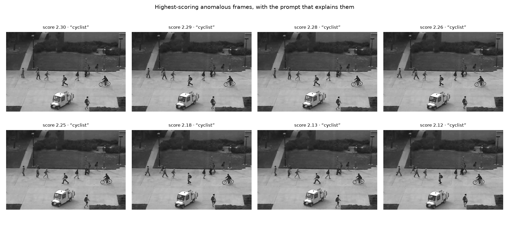
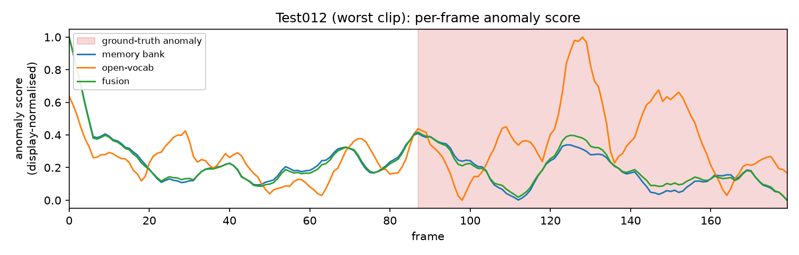

# Open-vocabulary video anomaly detection with CLIP

Two training-free anomaly detectors compared on **UCSD Ped2**:

- **Memory bank** — a frame is anomalous if it looks unlike any normal training frame (k-NN cosine distance).
- **Open-vocabulary** — a frame is anomalous if it matches a *textual description* of an anomaly better than one of normality. Uses no training data, and names the anomaly it found.

Both run on frozen CLIP embeddings. No gradient step anywhere, so the whole study reproduces on a CPU-only laptop.

## Results (frame-level)

| Method | Training data | AUC (micro) | AUC (macro) | AP |
| --- | --- | --- | --- | --- |
| Memory bank, *k*=5 | normal clips, no labels | **0.8820** | 0.8601 | 0.9741 |
| Open-vocabulary, zero-shot | **none** | 0.8361 | **0.9082** | 0.9641 |
| Naive z-score fusion | normal clips | 0.8746 | 0.8705 | 0.9730 |
| Calibration-aware fusion † | normal clips | **0.9048** | 0.9168 | — |

Smoothing window 11, except † at window 31. Full tables and ablations: [`results/RESULTS.md`](results/RESULTS.md).

## Findings

**Zero-shot scoring is competitive, and wins on macro AUC.** With no training data at all it reaches 0.908 macro, against 0.860 for a memory bank fitted on 2,550 normal frames.

**The micro/macro disagreement is a calibration problem.** The semantic scorer separates classes decisively *within* a clip (0.013 → 0.236 on Test001) but its scale drifts *between* clips (0.011 → 0.014 on Test012), so pooling frames destroys the ordering. Rank-normalising it per clip lifts micro AUC to 0.9048. A control confirms the mechanism: a *global* rank transform is monotone and leaves AUC unchanged (0.8361 → 0.8361).

**Naive fusion fails monotonically**, 0.8820 down to 0.8361 with no optimum in between — averaging a well-calibrated weak signal with a badly-calibrated strong one helps neither.

**Naming the vocabulary is worth ~0.106 AUC.** A prompt set naming Ped2's anomaly classes scores 0.8426; a generic control asking only for "an unusual event" scores 0.7367. Two surprises: the simplest named prompt beat both the enumerated and ensembled sets, and temporal smoothing (+0.035) mattered more than the choice of scorer.

**Explanations are free.** The open-vocabulary head keeps its per-prompt similarities, so each flagged frame carries the prompt that fired: `cyclist` 90.7%, `skateboard` 6.4%, `vehicle` 2.9%.



### Failure case

`Test012` scores **0.3362 — below chance**: the distance detector is anti-correlated with the ground truth, averaging 0.0182 on normal frames against 0.0171 on anomalous ones.



Distance scoring detects *novelty relative to the training set*, which is not the anomaly of interest. The semantic scorer (orange) fires correctly inside the anomalous interval; naive fusion (green) tracks the failing stream because z-scoring lets the distance scale dominate.

## Protocol

Frame labels come from the per-pixel ground-truth masks. Two choices that move the numbers:

- **Micro vs macro AUC.** Four of twelve test clips are *entirely* anomalous and carry no within-clip ROC signal, so pooling all frames and averaging per-clip AUCs are different measurements. Both are reported.
- **No per-clip normalisation in headline numbers.** Rescaling each clip to [0,1] assumes every clip contains both classes and inflates results. Fusion standardises globally instead.

Ped2 has no validation split, so the sweeps are a **sensitivity analysis**, not model selection.

## Reproducing

```bash
pip install -r requirements.txt

python scripts/prepare_data.py      # ~740 MB from the UCSD source
python scripts/run_benchmark.py     # -> results/benchmark_*.json
python scripts/run_ablations.py     # -> results/ablations_*.json
python scripts/make_figures.py      # -> results/figures/
python scripts/render_results.py    # -> results/RESULTS.md

python -m pytest tests -q           # 24 tests, no dataset or weights needed
```

Feature extraction is the only slow step and is cached, so the ablation sweep finishes in seconds. Throughput is re-measured on real frames each run rather than inferred from the cache (~8.5 frames/s on CPU).

## Layout

```
src/ucsd_vad/
  data.py       UCSD loading, labels from pixel masks
  features.py   CLIP encoding, caching, throughput
  prompts.py    prompt sets, including the generic control
  methods.py    scorers and fusion
  temporal.py   per-clip smoothing
  evaluate.py   micro/macro AUC, AP, EER
  viz.py        figures
  pipeline.py   experiment plumbing
scripts/        prepare_data, run_benchmark, run_ablations, make_figures, render_results
tests/          unit tests on synthetic arrays
```

## Limitations

One dataset, low-resolution and fixed-camera. Prompt sets were written from the dataset description, not blind — hence the generic control. Fusion is transductive (uses the evaluated split's score distribution, no labels). Frame-level only, so not comparable to pixel-level AUC. CPU timings.

Next steps: region proposals instead of whole-frame embeddings, to address small anomalous objects; and an online per-scene calibration estimate, to make the calibration fix deployable.

## Data and licence

Code is MIT. The UCSD Anomaly Detection Dataset belongs to its authors, is downloaded from the original source by `scripts/prepare_data.py`, and is not redistributed here.
